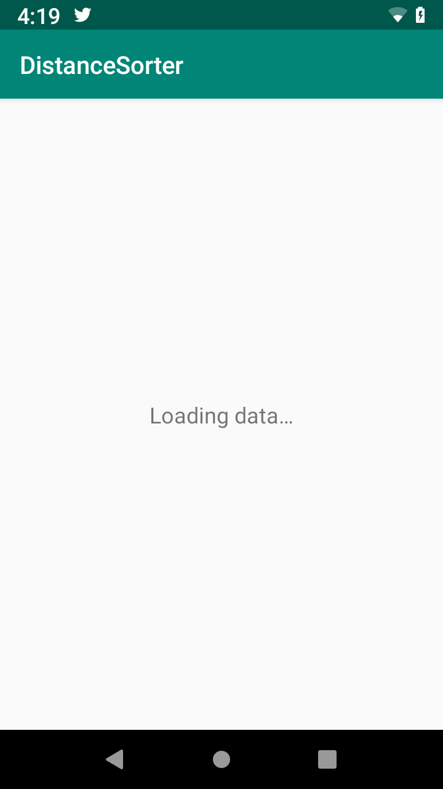
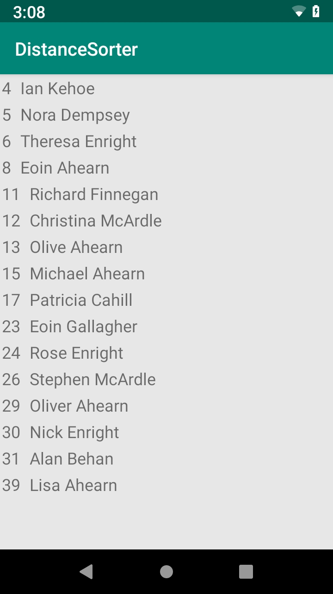

# Distance Sorter
The purpose of this app is to take a list of customers from a file and list those within 100km of a particular location.

If you're only interested in the text version of the output, [here](outputs/output.txt) it is.

Before the how, let's see what the end result looks like:

Let's take a look at the UI

Launched    | Loaded
:----------:|:--------------:
First, when the app is launched, the data is going to take some time to process, loading is shown | Once the data is loaded, and this happens asynchronously on a background thread, it is updated to the view.
 | 


# Architecture
The architecture of the app is LiveData to represent the view, coroutines for asynchronous handling of data. Together it achieves an MVVM style, which is aided by Dagger-Android's dependency injection. I normally use Rx though as can be seen from my other projects.

It was developed via TDD with the red-green-refactor method, as you could see from the git history, the core functionality was developed long before the app could actually be launched.

Clean architecture is used to isolate feature implementations within their own classes, here just one, [WithinMinimumDistanceUsecase](app/src/main/java/com/aniketkadam/distancesorter/distancecalculator/WithinMinimumDistanceUsecase.kt). An instance of this is created by the view model and used to  calculate the information required.

Data is loaded via [CustomerApi](app/src/main/java/com/aniketkadam/distancesorter/distancecalculator/data/CustomerApi.kt), which takes an inputstream and a gson instance and returns `List<Customer>`

This is useful because it takes the actual customer.txt from resources while running and from a test resource file, in unit tests. 

CustomerApi is injected into the [CustomerRepository](app/src/main/java/com/aniketkadam/distancesorter/distancecalculator/data/CustomerRepository.kt) via Dagger, where it exposes the information to the [DistanceCalculatorViewModel](app/src/main/java/com/aniketkadam/distancesorter/distancecalculator/DistanceCalculatorViewModel.kt)

I use a slightly different way of injecting my view model which means I can just annotate the vm with inject in the activity or fragment and it happens. This is achieved via [MainModule](app/src/main/java/com/aniketkadam/distancesorter/distancecalculator/distancesorter/di/MainModule.kt)

### Data Modelling
[Customer](app/src/main/java/com/aniketkadam/distancesorter/distancecalculator/data/Customer.kt)'s have a user id, name and [Coordinates](app/src/main/java/com/aniketkadam/distancesorter/distancecalculator/data/Coordinates.kt) to verify that the json of individual user definitions can be loaded properly,
CustomerApi performs a read of an input stream line by line, and maps each line to a [CustomerResponse](app/src/main/java/com/aniketkadam/distancesorter/distancecalculator/data/CustomerResponse.kt). The response is the intermediary representation, featuring Gson's SerializedName annotations on its fields to ensure preservation of data after proguard runs.
The response is then mapped to an actual customer object, this is enforced via all its fields being private and only the `toCustomer` function being exposed. Thus preventing it from being used for anything else.

The reading and mapping can be observed in the CustomerApi class and the test which ensures this happens smoothly for all existing values in the customer.txt.
[Test](app/src/test/java/com/aniketkadam/distancesorter/distancecalculator/data/CustomerApiTest.kt)

### View
[MainActivity](app/src/main/java/com/aniketkadam/distancesorter/distancecalculator/MainActivity.kt) remains the entry point to the app. It does three things:
1. Initialize the recyclerview which will be used to show the results.
2. Bind the viewmodel's customersWithinMinDistance livedata, to the render function within it.
3. The render function decides to show/hide the loading view and puts data into the adapter.

### ViewModel
[DistanceCalculatorViewModel](app/src/main/java/com/aniketkadam/distancesorter/distancecalculator/DistanceCalculatorViewModel.kt) is the sole ViewModel
1. An LCE is created to hold the mutually exclusive states of loading or content, this is held in the LiveData customersWithinMinDistance
2. A private mutable instance, which provides the backing field for the public `LiveData<Lce>`  customersWithinMinDistance, is initialized with Loading.
3. Origin coordinates and minimum distance are queried from the [CustomerRepository](app/src/main/java/com/aniketkadam/distancesorter/distancecalculator/data/CustomerRepository.kt)
4. These are passed into the [WithinMinimumDistanceUsecase](app/src/main/java/com/aniketkadam/distancesorter/distancecalculator/WithinMinimumDistanceUsecase.kt) which finds the customers and returns them.
5. The query within the usecase is moved onto an IO thread with coroutines.
6. The final result is passed into the LiveData for the View to observe.
7. This results in an initial state of loading, followed by the data.

This is tested via the [DistanceCalculatorViewModelTest](app/src/test/java/com/aniketkadam/distancesorter/distancecalculator/DistanceCalculatorViewModelTest.kt) which creates a mock repository and verifies that the livedata at the end is in the expected state.

#### LiveData testing and modification to await multiple values.
As stated [publicly](https://twitter.com/ppvi/status/1169498619105427456), livedata needs to be tested with a [copy/pasted](https://github.com/android/architecture-components-samples/blob/master/LiveDataSample/app/src/test/java/com/android/example/livedatabuilder/util/LiveDataTestUtil.kt) helper function.
However, this class is insufficient for you're looking to await multiple values. So I [changed](https://github.com/AniketSK/DistanceSorter/commit/586a00b9713705a48c2d984fee800cf74370b656) the implementation to take this param.

### UseCase
[WithinMinimumDistanceUsecase](app/src/main/java/com/aniketkadam/distancesorter/distancecalculator/WithinMinimumDistanceUsecase.kt) is where all the calculations actually happen.

1. calculateDistance takes two sets of Coordinates containing only latitude and longitude and calculates their great circle distance.
2. isWithinMinimumDistance uses calculateDistance and the passed in minimum distance to return a boolean.
3. roundToErrorMargin is used in tests to verify distances.
4. `execute` is the function within this usecase that puts everything together. It receives the customers, filter's them via isWithinMinimumDistance and returns a kotlin `sortedBy` userId list.
5. This happens within a suspension function that moves execution to the IO thread.

Tests are conducted via [WithinMinimumDistanceUsecaseTest](app/src/test/java/com/aniketkadam/distancesorter/distancecalculator/WithinMinimumDistanceUsecaseTest.kt) these consist of having a pair of coordinates and their known distance, compared with the calculated result.

These are rounded off to 0.5% of the expected 100km distance.

Since only the execute method which puts all parts of this together is a suspension function, the testing is simplified.

# Calculation of great circle distance
We're going to run an initial calculation of the two coordinates, 53.339428, -6.257664 and 52.986375, -6.043701
Using the wikipedia formula:
```kotlin
import java.lang.Math.*

// Calculate Earth Radius
// From: https://en.wikipedia.org/wiki/Great-circle_distance#Radius_for_spherical_Earth
val equatorialRadius : Double = 6378.137
val polarRadius : Double = 6356.752
val meanEarthRadius: Double = (1.0 / 3.0) * (2 * equatorialRadius + polarRadius)

// Note that all results are only within an error bound since the Earth isn't perfectly spherical and we've made assumptions.
val errorMargin = 0.005

// Taking sample values, where lambda is longitude, and theta is latitude.
// For two coordinate values, lambda1 (longitude) = l1, theta1 (latitude) = t1 and for the second set of coordinates, l2, t2  
val l1 : Double = toRadians(-6.257664) // All values are given to us in degrees so they must be converted to radians
val l2 : Double = toRadians(-6.043701)

val t1 : Double = toRadians(53.339428)
val t2 : Double = toRadians(52.986375)

val dLambda : Double = l1 - l2

val centralAngle = acos(sin(t1) * sin(t2) + cos(t1) * cos(t2) * cos(dLambda))

val distance = meanEarthRadius * centralAngle

System.out.print(distance) // ~41.7km

// Note that if the distance is within 0.5% of the minimum distance, for safety's sake, we may want to include those people.

```

To double check our numbers, a sanity check was performed with:
1. Google Maps, which lists it as 47km reasonable for a walking distance that isn't straight line.
2. Another site https://www.gpsvisualizer.com/calculators#distance which shows the distance to be 41.8km

Allowing for variations in radius of the earth used and such, the final value looks quite reasonable. 
